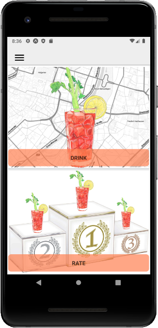
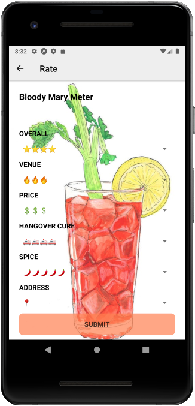
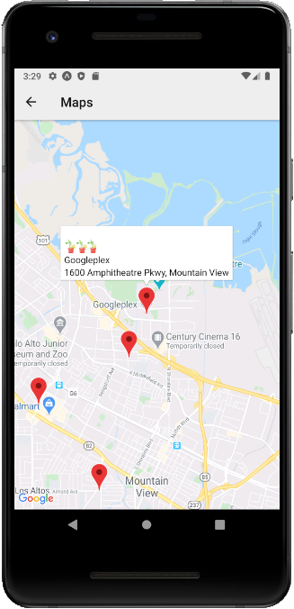
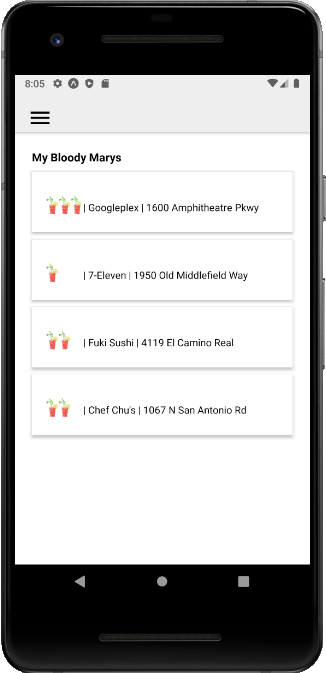

# Bloody-Mary-Index

Finally, Bloody Mary lovers can find and rate the best Bloody Marys in town at all times!

Wikipedia: A Bloody Mary is a **cocktail** containing vodka, **tomato juice**, and other spices and flavorings including Worcestershire sauce, **hot sauces**, garlic, herbs, horseradish, celery, olives, salt, black pepper, lemon juice, lime juice or celery salt. In the United States, it is usually consumed in the **morning or early afternoon**, and is popular as a **hangover cure**.

## Screenshots

  
  

  
  

## Run the app

Instructions for Android only

- **1. Fork and clone the repository.**
- **2. Run "npm install" from the project directory (root)**
- **3. Run "expo install" from the project directory (root)**
- **4. Get an API key for Google maps** 
   You can follow this tutorial if you haven't done this before: https://developers.google.com/maps/documentation/javascript/get-api-key
   Once you have the key, you can find the app.json file and paste it into the "apiKey" property of the android object.
- **5. Install Android Studio so you can run the app on a virtual device.**
- **6. Run "nodemon" in /server.**
- **7. Run "npm start" in project folder (root).**

## Tech-stack
* React Native
* Google maps API
* Expo
* Express
* Mongoose
* MongoDB

## Observations
* Add friends functionality to display your buddies Bloody Marys as well
* Add Google places API
* Rethink UI. Styling can be improved
* Implement testing

### Developer
Leonard Schilcher [LinkedIn](https://www.linkedin.com/in/leonard-schilcher/)
